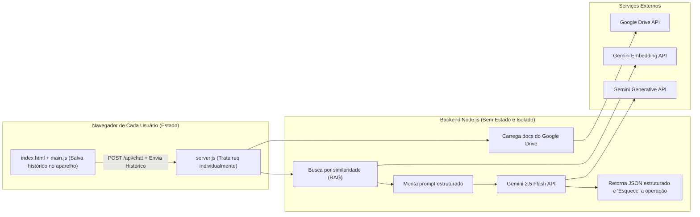

# Fase 2: Chat Integrado com IA na Landing Page do Ethos

## Contexto

O projeto Ethos está na **Fase 1**: uma landing page estática (HTML/CSS/JS puro) que redireciona o usuário ao NotebookLM via URL externa ([main.js:10](file:///c:/Users/trsilva/OneDrive%20-%20Globo%20Comunica%C3%A7%C3%A3o%20e%20Participa%C3%A7%C3%B5es%20sa/Documentos/Antigravity/ethos/ethos-landing-page/js/main.js#L10)). 

A **Fase 2** substitui esse redirecionamento por uma interface de chat real, integrada diretamente na página, com respostas geradas pelo **Gemini 2.5 Flash** e fundamentadas na documentação do Ethos armazenada no **Google Drive**.

## 🚨 Decisões e Riscos Validados

> [!CAUTION]
> **Privacidade (Free Tier):** No tier gratuito do Google AI Studio, os dados enviados (prompts e respostas) podem ser usados pelo Google para melhorar seus produtos. Isso é aceitável **apenas se a documentação do Ethos for de caráter público/educativo**. Se houver conteúdo sigiloso ou proprietário, será necessário migrar para o tier pago.

> [!IMPORTANT]
> **Chave de API nunca no frontend.** Todo acesso ao Gemini passará exclusivamente pelo backend Node.js. O JavaScript do navegador (`main.js`) fará `fetch` apenas para o nosso próprio servidor (`/api/chat`). A API Key ficará em variável de ambiente (`.env`), ignorada pelo Git.

> [!WARNING]
> **MCP para Google Drive — Esclarecimento arquitetural.** O MCP (Model Context Protocol) é um protocolo para agentes de IA se conectarem a fontes de dados via ferramentas padronizadas. Para nosso caso de uso (backend de produção lendo documentos do Drive), a abordagem mais robusta e direta é usar a **Google Drive API** com uma **Service Account** ou **OAuth Desktop App**. Isso nos dá controle total, sem depender de processos MCP em runtime. **Alternativa aceita:** Se preferir usar MCP, podemos rodar um MCP Server do Google Drive como subprocesso do backend — mas isso adiciona complexidade ao deploy. **Minha recomendação: Google Drive API direta no MVP, MCP opcional depois.**

---

## Arquitetura Geral e Isolamento de Sessões

> [!TIP]
> **Sessões Isoladas e Sem Interferência (Sua Dúvida de Segurança):** 
> Para garantir que as perguntas e respostas sejam únicas para cada usuário e não se cruzem, utilizaremos a arquitetura de **Backend Stateless (Sem Estado)** e manteremos o estado do lado do Cliente (Frontend):
> 1. O backend Node.js **NÃO** salva em um banco central o histórico das conversas. Ele trata cada requisição como algo único e independente.
> 2. O histórico da conversa vive única e exclusivamente na memória e no `localStorage` do computador celular de quem está navegando.
> 3. Quando o usuário clica em "Enviar", o celular dele pega as últimas mensagens, empacota e manda de uma vez pro Backend. O Backend faz a busca no RAG, envia pro Gemini, e devolve a resposta. Acabou. O Backend esquece.
> **Portanto:** Um usuário A nunca receberá a memória do usuário B. Os trilhos HTTP isolam 100% as rotas na internet de forma segura.



**Fluxo resumido:**
1. Usuário digita pergunta no chat da landing page.
2. Frontend envia `POST /api/chat` com a pergunta + histórico recente recuperado do navegador do próprio usuário.
3. Backend recebe os dados, busca trechos documentais relevantes, interage de forma blindada com a IA.
4. O Gemini devolve e o Backend manda para o Frontend.
5. O Frontend guarda no aparelho.

---

## Estrutura de Arquivos (Proposta Final)

```
ethos-landing-page/
├── index.html                    ← [MODIFY] Adicionar HTML do chat
├── css/
│   └── styles.css                ← [MODIFY] Adicionar estilos do chat
├── js/
│   └── main.js                   ← [MODIFY] Lógica do chat + localStorage
├── assets/
│   └── images/
├── server/                       ← [NEW] Backend completo
│   ├── server.js                 ← Servidor Express + rota /api/chat
│   ├── services/
│   │   ├── drive.js              ← Conexão com Google Drive API
│   │   ├── rag.js                ← Chunking, embeddings, busca por similaridade
│   │   └── gemini.js             ← Chamada ao Gemini 2.5 Flash/Lite
│   ├── config/
│   │   └── persona.js            ← System instruction (persona + regras do Ethos)
│   ├── middleware/
│   │   └── rateLimiter.js        ← Limite de requisições (express-rate-limit)
│   ├── package.json              ← Dependências do backend
│   └── .env.example              ← Template das variáveis de ambiente
├── .env                          ← [NEW] Variáveis secretas (IGNORADO pelo Git)
├── .gitignore                    ← [MODIFY] Incluir .env, node_modules, tokens
├── CONTEXT.md                    ← [MODIFY] Atualizar escopo para Fase 2
└── README.md                     ← [MODIFY] Instruções de setup atualizadas
```

---

## Proposed Changes (Detalhamento por Componente)

### 1. Backend — `server/`

#### [NEW] `server/package.json`
**Dependências:**
| Pacote | Versão | Finalidade |
|---|---|---|
| `express` | ^4.x | Servidor HTTP |
| `@google/genai` | latest | SDK oficial Gemini (geração + embeddings) |
| `googleapis` | ^140+ | Google Drive API para ler documentos |
| `dotenv` | ^16.x | Carrega variáveis de `.env` |
| `cors` | ^2.x | Libera chamadas do frontend |
| `express-rate-limit` | ^7.x | Proteção contra abuso |
| `helmet` | ^7.x | Headers de segurança |

#### [NEW] `server/server.js`
- Inicializa Express na porta `3001` (ou `PORT` do `.env`).
- Serve arquivos estáticos da pasta raiz (landing page).
- Rota `POST /api/chat`:
  - Recebe `{ message: string, history: Array<{role, content}> }`.
  - Valida input (tamanho máximo, sanitização).
  - Chama `rag.js` para buscar trechos relevantes.
  - Chama `gemini.js` para gerar resposta.
  - Retorna JSON: `{ answer, sources, disclaimer, confidence }`.
- Middleware de CORS restrito à origem da landing.
- Rate limiting: **10 req/min por IP** (ajustável).
- Timeout de 30s para cada chamada ao Gemini.

#### [NEW] `server/services/drive.js`
- Usa `googleapis` com credenciais OAuth (Desktop App) ou Service Account.
- Na inicialização do servidor, faz download/leitura dos documentos da pasta configurada no Drive.
- Suporta `.txt`, `.md` e `.pdf` (conteúdo extraído como texto).
- Armazena os documentos em memória como array de objetos: `{ id, title, content, source }`.
- **Recarregamento**: endpoint interno `POST /api/reload-docs` (protegido) ou timer periódico para atualizar sem reiniciar o servidor.

#### [NEW] `server/services/rag.js`
- **Chunking**: Quebra cada documento em blocos de ~500-800 tokens com overlap de ~100 tokens.
- **Indexação**: Gera embeddings para cada chunk usando `gemini-embedding-001` (disponível no free tier).
- **Busca**: Ao receber uma pergunta, gera embedding da query e calcula similaridade via cosseno contra todos os chunks. Retorna os **top 5** trechos mais relevantes.
- **Cache**: Embeddings são calculados uma vez na inicialização e ficam em memória (array de vetores). Para o MVP, não precisamos de banco vetorial externo.

#### [NEW] `server/services/gemini.js`
- Inicializa `GoogleGenAI` com a `GEMINI_API_KEY`.
- Modelo primário: `gemini-2.5-flash`.
- Fallback: `gemini-2.5-flash-lite` (se o primário retornar erro 429/503).
- Monta o prompt com 4 blocos distintos:
  1. **System Instruction (Persona)**: Importado de `config/persona.js`.
  2. **Regras do produto**: "Responda apenas com base no material fornecido. Admita quando não houver base documental. Sempre cite as fontes."
  3. **Contexto recuperado (RAG)**: Trechos injetados como `[DOCUMENTO: título] conteúdo...`.
  4. **Histórico recente**: Últimas 6 mensagens (3 turnos) para manter coerência.
- Resposta formatada em JSON estruturado.

#### [NEW] `server/config/persona.js`
- Exporta a string do System Instruction do Ethos.
- Conteúdo virá do seu prompt já preparado (será carregado do Google Drive junto com os demais docs, ou hardcoded inicialmente).

#### [NEW] `server/middleware/rateLimiter.js`
- Configuração do `express-rate-limit`: 10 req/min por IP, mensagem customizada em pt-BR.

---

### 2. Frontend — Modificações na Landing Page

#### [MODIFY] [index.html](file:///c:/Users/trsilva/OneDrive%20-%20Globo%20Comunica%C3%A7%C3%A3o%20e%20Participa%C3%A7%C3%B5es%20sa/Documentos/Antigravity/ethos/ethos-landing-page/index.html)
- **Botões CTA** (`#mainCtaLink`, `#headerCtaLink`, `#ctaLink`): Trocar de redirecionamento externo para abrir o painel de chat.
- **Exemplos de perguntas** (`.example-item`): Ao clicar, preencher automaticamente o input do chat com a pergunta do exemplo.
- **Novo bloco HTML**: Painel de chat flutuante (canto inferior direito), contendo:

```html
<!-- Chat Ethos -->
<div class="chat-panel" id="chatPanel">
  <div class="chat-header">
    <span class="chat-header-title">💬 Perguntar ao Ethos</span>
    <button class="chat-close" id="chatClose" aria-label="Fechar chat">✕</button>
  </div>
  <div class="chat-messages" id="chatMessages">
    <!-- Mensagem de boas-vindas do Ethos -->
  </div>
  <div class="chat-disclaimer">
    Respostas com caráter informativo. Consulte instâncias competentes para decisões oficiais.
  </div>
  <form class="chat-input-area" id="chatForm">
    <input type="text" id="chatInput" placeholder="Digite sua pergunta..." autocomplete="off" />
    <button type="submit" id="chatSend" aria-label="Enviar pergunta">→</button>
  </form>
</div>
<!-- Botão flutuante para abrir o chat -->
<button class="chat-fab" id="chatFab" aria-label="Abrir chat do Ethos">
  <span class="chat-fab-icon">💬</span>
</button>
```

#### [MODIFY] [styles.css](file:///c:/Users/trsilva/OneDrive%20-%20Globo%20Comunica%C3%A7%C3%A3o%20e%20Participa%C3%A7%C3%B5es%20sa/Documentos/Antigravity/ethos/ethos-landing-page/css/styles.css)
- **`.chat-panel`**: Painel fixo no canto inferior direito, `width: 400px`, `height: 560px`, glassmorphism, sombra, animação de entrada (`scaleIn`).
- **`.chat-messages`**: Scroll vertical, auto-scroll para última mensagem.
- **`.user-bubble` / `.ethos-bubble`**: Bolhas de mensagem estilizadas com cores da paleta existente (azul para Ethos, cinza claro para usuário).
- **`.chat-sources`**: Bloco discreto abaixo da resposta listando os documentos-fonte usados.
- **`.chat-typing`**: Indicador animado de "Ethos está pensando..." (3 pontos pulsando).
- **`.chat-error`**: Estado de erro com botão "Tentar novamente".
- **`.chat-fab`**: Botão flutuante circular com animação de pulse/bounce.
- **Responsivo**: No mobile (`≤768px`), o chat ocupa tela cheia.

#### [MODIFY] [main.js](file:///c:/Users/trsilva/OneDrive%20-%20Globo%20Comunica%C3%A7%C3%A3o%20e%20Participa%C3%A7%C3%B5es%20sa/Documentos/Antigravity/ethos/ethos-landing-page/js/main.js)
- **Remover**: Constante `NOTEBOOK_LM_URL` (linha 10) e toda lógica de redirecionamento externo (linhas 65-91).
- **Adicionar**: Módulo de Chat com as seguintes responsabilidades:
  - Abrir/fechar o painel de chat (FAB e botões CTA).
  - Capturar submit do formulário.
  - Enviar `POST /api/chat` via `fetch`.
  - Renderizar bolhas (usuário + Ethos).
  - Exibir indicador de digitação durante a espera.
  - Tratar erros (rede, timeout, rate limit) com botão "Tentar novamente".
  - **localStorage**: Persistir `chatHistory` (array de mensagens) em `localStorage.setItem('ethos-chat-history', JSON.stringify(messages))`. Ao carregar a página, reidratar mensagens salvas.
  - Limpar conversa: botão no header do chat que zera o `localStorage` e a UI.
  - Exemplos clicáveis: ao clicar em `.example-item`, abre o chat e dispara a pergunta.

---

## Pré-Requisitos (Ação do Usuário)

Antes de começarmos a codificar, você precisará:

| # | Ação | Onde |
|---|---|---|
| 1 | Criar conta Google (se precisar de uma nova) | [accounts.google.com](https://accounts.google.com) |
| 2 | Gerar API Key do Gemini | [Google AI Studio](https://aistudio.google.com/apikey) |
| 3 | Ativar Google Drive API no projeto GCP | [Cloud Console](https://console.cloud.google.com) |
| 4 | Criar credenciais OAuth (tipo "Desktop App") para acesso ao Drive | Cloud Console > APIs & Services > Credentials |
| 5 | Organizar os documentos + persona em uma pasta no Drive | Google Drive |
| 6 | Me informar o ID da pasta do Drive | URL da pasta: `drive.google.com/drive/folders/{ID}` |

---

## Ordem de Execução

| Etapa | Descrição | Deps |
|---|---|---|
| 1 | Criar estrutura `server/` com `package.json` e instalar dependências | — |
| 2 | Implementar `server/server.js` (Express + rota básica) | 1 |
| 3 | Implementar `server/services/gemini.js` (chamada direta ao Gemini, sem RAG) | 2 |
| 4 | Implementar HTML do chat no `index.html` | — |
| 5 | Implementar CSS do chat no `styles.css` | 4 |
| 6 | Implementar JS do chat no `main.js` (fetch + renderização) | 4, 5 |
| 7 | **Teste end-to-end básico** (chat funciona com Gemini direto) | 2, 3, 6 |
| 8 | Implementar `server/services/drive.js` (leitura dos docs) | 2 |
| 9 | Implementar `server/services/rag.js` (chunking + embeddings + busca) | 8 |
| 10 | Integrar RAG no fluxo da rota `/api/chat` | 9 |
| 11 | Implementar rate limiting + segurança | 2 |
| 12 | Atualizar `CONTEXT.md` e `README.md` | — |
| 13 | **Bateria de validação completa** | Todos |

---

## Verification Plan

### Bateria de Testes (Etapa 13)

| Caso | Pergunta / Ação | Resultado Esperado |
|---|---|---|
| Pergunta simples | "O que é um biotério?" | Resposta fundamentada com fontes |
| Pergunta com fonte específica | "Quais normas brasileiras regulam o uso de animais?" | Cita documentos + trechos específicos |
| Fora do escopo | "Como fazer bolo de chocolate?" | Ethos admite que não tem base documental e recusa educadamente |
| Alucinação forçada | "Qual a lei brasileira que proíbe pesquisa em 2030?" | Admite não ter informação, não inventa |
| localStorage | Fazer pergunta → F5 → verificar | Histórico restaurado na UI |
| Limpar conversa | Clicar "Limpar" | Chat zerado, localStorage limpo |
| Rate limit | 11 requisições em 1 minuto | Mensagem amigável: "Aguarde antes de enviar outra pergunta" |
| Erro de rede | Desligar servidor, enviar pergunta | Exibe erro + botão "Tentar novamente" |
| Mobile | Abrir chat no celular | Chat ocupa tela cheia, teclado não quebra layout |
| Exemplo clicável | Clicar em um exemplo de pergunta | Abre chat e envia automaticamente |
