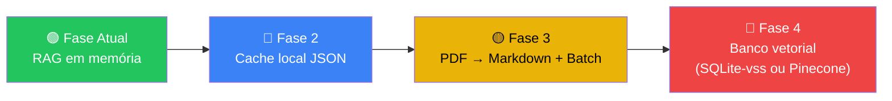

# Guia de Otimização do RAG — Ethos

## O Problema Atual

Hoje, **a cada vez que o servidor reinicia**, ele precisa:

1. Baixar os 7 PDFs do Google Drive (~12 MB de texto bruto)
2. Extrair texto de cada PDF (parsing)  
3. Fatiar o texto em ~3.000+ chunks
4. Chamar a API do Gemini **uma vez por chunk** para gerar embeddings vetoriais
5. Montar o índice em memória

O gargalo está nos **passos 4 e 5**: são ~3.000 chamadas HTTP à API do Google, limitadas pelo rate limit (15 RPM no plano gratuito do `gemini-embedding-001`). Isso leva **vários minutos** a cada cold start.

---

## Estratégias de Otimização (da mais simples à mais robusta)

### 1. 💾 Cache Local de Embeddings (Rápida Implementação)

**Ideia:** Depois de gerar os embeddings pela primeira vez, salvar tudo num arquivo JSON local. Na próxima inicialização, carregar do arquivo em vez de chamar a API.

**Como funciona:**
```
1ª inicialização: Drive → PDF → Chunks → API Embedding → index.json (salva)
2ª inicialização: index.json (carrega) → pronto em <1 segundo
```

**Prós:**
- Implementação simples (~30 linhas de código)
- Tempo de boot cai de **minutos → milissegundos**
- Zero custo adicional de API
- Invalida automaticamente quando detecta mudança nos documentos (hash/timestamp)

**Contras:**
- Arquivo `index.json` pode ficar grande (~50-100 MB com 3000+ vetores)
- Ainda precisa do "primeiro boot" lento

> [!TIP]
> Esta é a **melhor relação custo-benefício** para o seu caso atual. Resolve 95% do problema sem mudar a arquitetura.

---

### 2. 📄 Pré-processamento: PDF → Markdown

**Ideia:** Converter os PDFs em Markdown uma única vez (offline) e subir os `.md` no Drive em vez dos PDFs.

**Prós:**
- Markdown é ~10x mais leve que PDF extraído
- Parsing instantâneo (sem dependência de `pdf-parse`)
- Chunks mais limpos (sem artefatos de layout, cabeçalhos repetidos, etc.)
- Melhor qualidade de embedding (texto mais estruturado = melhor busca semântica)

**Contras:**
- Processo manual de conversão (ou semi-automatizado com ferramentas como `marker`, `docling`, `pymupdf4llm`)
- Precisa reconverter quando o PDF original mudar

**Ferramentas de conversão recomendadas:**
| Ferramenta | Linguagem | Qualidade | Observação |
|-----------|-----------|-----------|------------|
| `marker` | Python | ⭐⭐⭐⭐⭐ | Melhor qualidade, usa ML |
| `docling` (IBM) | Python | ⭐⭐⭐⭐ | Boa com tabelas |
| `pymupdf4llm` | Python | ⭐⭐⭐⭐ | Rápido, leve |
| Google Document AI | API | ⭐⭐⭐⭐⭐ | Pago, mas excelente para OCR |

> [!NOTE]
> Pode ser combinada com a Estratégia 1 para o melhor resultado possível sem mudar infraestrutura.

---

### 3. 🗄️ Banco de Dados Vetorial (Arquitetura Profissional)

**Ideia:** Substituir o índice em memória por um banco vetorial dedicado que persiste os embeddings e faz buscas otimizadas.

#### Opções Gratuitas/Self-Hosted

| Banco | Tipo | Facilidade | Observação |
|-------|------|-----------|------------|
| **SQLite + `sqlite-vss`** | Arquivo local | ⭐⭐⭐⭐⭐ | Zero infraestrutura, perfeito para o Ethos atual |
| **ChromaDB** | Self-hosted | ⭐⭐⭐⭐ | API Python, mas tem client JS |
| **Qdrant** | Self-hosted | ⭐⭐⭐⭐ | Alto desempenho, Docker |
| **Weaviate** | Self-hosted | ⭐⭐⭐ | Mais complexo, features enterprise |

#### Opções Cloud (Managed)

| Serviço | Tier Gratuito | Observação |
|---------|-------------|------------|
| **Pinecone** | 1 index grátis | Mais popular, fácil de usar |
| **Supabase pgvector** | 500 MB grátis | PostgreSQL + vetores, fullstack |
| **Google Cloud Vertex AI Vector Search** | Pay-as-you-go | Integração nativa com Gemini |
| **Turso + `libsql-vector`** | 9 GB grátis | SQLite na edge, muito rápido |

**Prós:**
- Boot **instantâneo** (embeddings já estão persistidos)
- Busca otimizada com índices ANN (Approximate Nearest Neighbor)
- Escalável para milhões de documentos
- Suporta updates incrementais (adiciona 1 PDF novo sem reindexar tudo)

**Contras:**
- Complexidade de infraestrutura (deploy, manutenção)
- Pode ter custo (nas opções cloud)

> [!IMPORTANT]
> Para o Ethos em produção com múltiplos usuários, esta é a abordagem recomendada. **SQLite + sqlite-vss** seria o caminho mais natural de migração dado o seu stack atual (zero infraestrutura extra).

---

### 4. 🔄 Embedding em Batch (Otimização de API)

**Ideia:** Em vez de enviar 1 chunk por vez à API, enviar múltiplos chunks numa única chamada.

**Como funciona:**
```
Atual:    chunk1 → API → embedding1, chunk2 → API → embedding2, ... (3000 chamadas)
Otimizado: [chunk1...chunk100] → API → [emb1...emb100]        (30 chamadas)
```

**Prós:**
- Reduz tempo de rede drasticamente (~100x menos chamadas)
- A API do Gemini suporta batch embedding nativamente

**Contras:**
- Ainda depende da API a cada restart (sem cache)
- Limites de tamanho por request

> [!TIP]
> Combinando batch + cache local, o primeiro boot cai de minutos para ~30 segundos, e boots subsequentes para <1 segundo.

---

### 5. 🧠 Google Vertex AI RAG Engine (Solução Enterprise)

**Ideia:** Usar o serviço gerenciado de RAG do Google Cloud, que faz tudo automaticamente (ingestion, chunking, embedding, busca).

**Como funciona:**
- Você aponta para a pasta do Drive
- O Vertex AI faz o resto: chunking, embedding, indexação, busca
- Sua API só faz: `query → Vertex RAG → resposta com contexto`

**Prós:**
- Zero gerenciamento de embeddings
- Integração nativa com Drive e Gemini
- Escalável para qualquer volume

**Contras:**
- Custo do Google Cloud (sem tier gratuito para RAG)
- Vendor lock-in

---

## Recomendação de Roadmap



| Fase | Esforço | Impacto no Boot | Quando |
|------|---------|----------------|--------|
| **Fase 2: Cache JSON** | ~2h | Minutos → <1s (2º boot) | **Próxima sprint** |
| **Fase 3: MD + Batch** | ~4h | 1º boot: minutos → ~30s | Quando adicionar mais docs |
| **Fase 4: Banco Vetorial** | ~1-2 dias | Sempre <1s, busca otimizada | Produção com múltiplos usuários |

> [!IMPORTANT]
> **Recomendação imediata:** Implementar a **Fase 2 (Cache Local)** resolve o problema de UX hoje, com esforço mínimo. As fases seguintes são para quando o Ethos crescer em volume de documentos ou número de usuários simultâneos.
